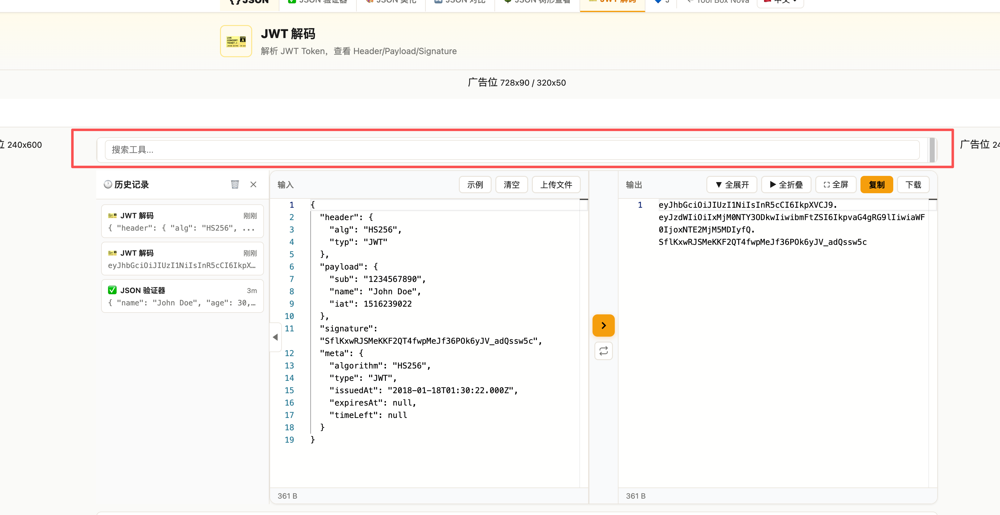

修复下面问题：

1、Json对比也要换成中间是互换按钮+橙色按钮的交互方式，并且输入和输出框大小和其他工具统一。
2、互换按钮也要垮工具区跳转到对应的功能区域。
3、树形查看为什么输入和输出中间区域多了全部展开和全部折叠，可以去掉。
5、历史纪录为什么只保留三条，操作超过3次之后，最新的永远是覆盖，建议保留50条，超过后淘汰最先的操作
6、所有json的缩进功能功能都放到输入框上面跟示例挨着。
7、工具选择搜索无效，点击需要下拉展示所有工具，并且支持搜索。

