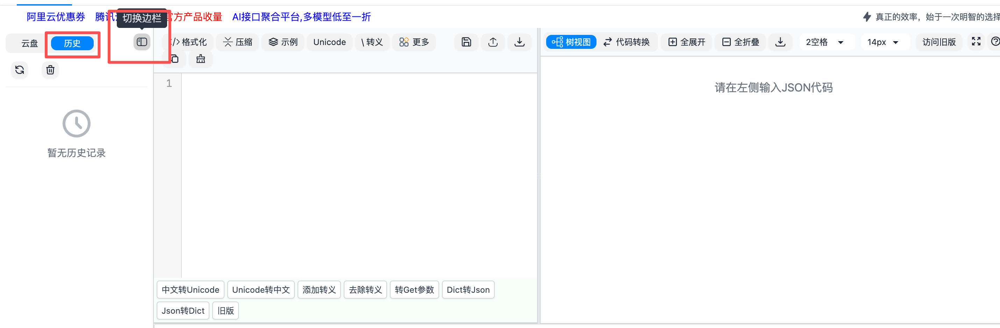
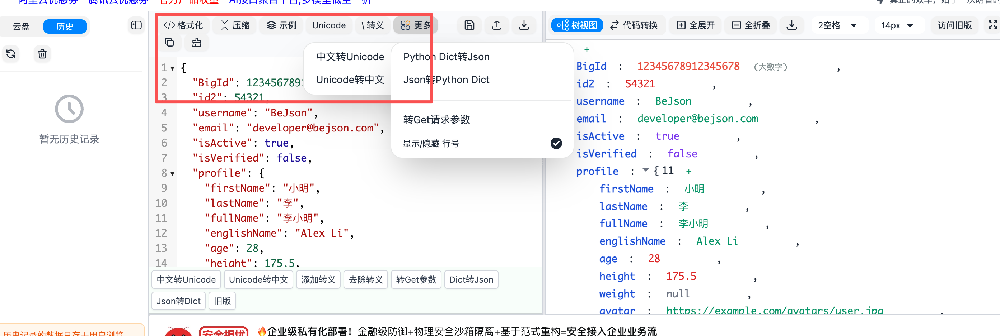
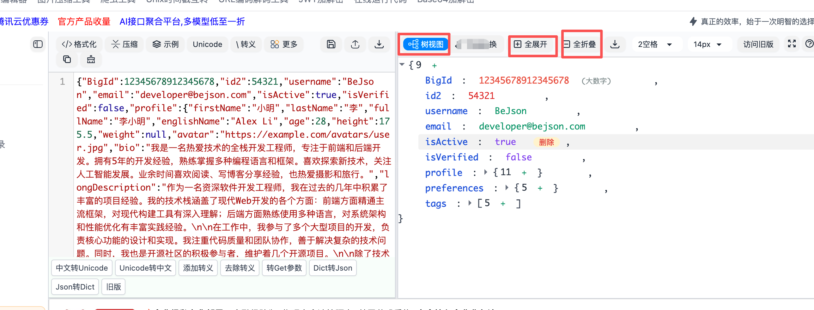
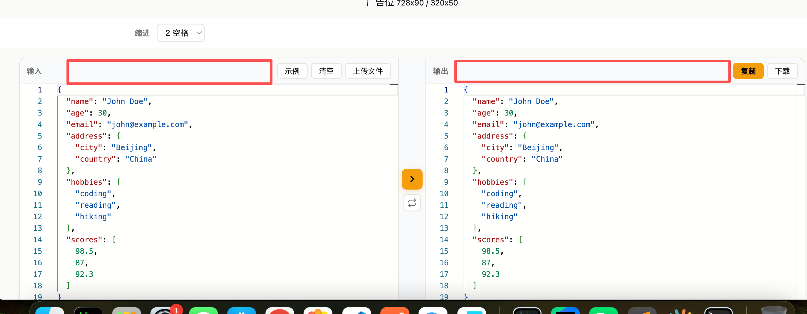

我想对json工具进行一些优化和升级，以提高功能体验。主要的调整包括下面几点：
## 需求一
竞品的分析如下：
竞品在用户输入框的左边增加了一历史记录的功能，用户可以通过点击历史记录来快速选择之前输入过的内容。这种设计可以提高用户的效率，减少重复输入的时间。
旁边还有一个”切换边栏“的按钮，主要是把历史记录折叠，折叠之后可以点击它打开
可以参考下图：

我也想把这个功能实现了

## 需求二
这个json工具把所有工具都集成到输入框的上面点，可以直接操作其他工具不用切换界面了，提升了用户的操作效率。用户可以直接在输入框上方看到所有可用的工具，并且可以直接点击使用，无需切换到其他界面。这种设计可以让用户更方便地使用工具，提高工作效率。

可以参考它的方式把工具集成到输入框上方，提升用户的操作效率。但是因为工具非常多，建议做成下拉选择的方式，输入框内输入内容，下拉选择要操作的结果，选择之后点中间橙色箭头右边输入框可以看到结果，不用在多个工具之间来回切换

## 需求三
右边输出框的，树视图、全展开、全折叠、以及放大整个输入框也很好用，如下图：这三个功能也可以开发

这几个功能都是在现在功能的基础上开发的优化和升级，旨在提升用户的使用体验和效率。通过引入历史记录功能、工具集成以及输出框的增强功能，可以让用户更方便地使用json工具，减少操作步骤，提高工作效率。这些调整将使json工具更加实用和用户友好。

不要改变现在功能的逻辑、以及这种风格，只是增加需求而已。

在下面红框内添加需求。现在json工具有40+个哦，需要你分析下，哪些可以加哪些不需要加，你要分析是不是能给用户提高体验和幸福度来加
