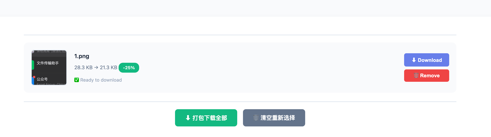

下面几个问题需要调整

## 问题一
在线图片压缩工具，上传图片压缩后，download、remove按钮太丑了，整个非常长。需要优化一下样式，参考https://tinypng.com/的设计
你看下我传的图片，显示的是大图，而不是缩略图

预期的样式如下图

## 问题二
在线图片压缩工具，国际化没有做完，仔细检查没重语言的切换是否正常，目前来看是不够的

## 问题三
在线图片压缩工具，现在功能的描述太少了，增加到700字左右，为了seo优化，增加一些关键词，描述一下在线图片压缩工具的功能和优势，以及使用方法等内容。